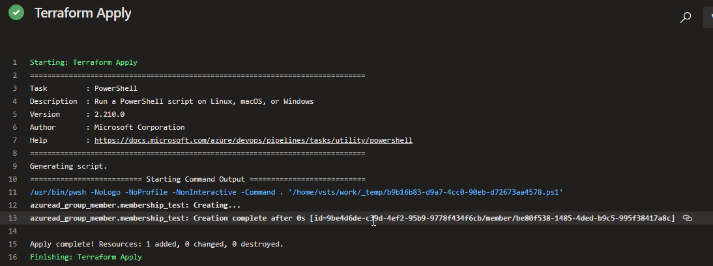

# Introduction 

This sample illustrates how a Terraform service principal can be granted permission to only update **specific** groups, via the [azuread_group_member](https://registry.terraform.io/providers/hashicorp/azuread/latest/docs/resources/group_member) resource.

The docs say:

> When authenticated with a service principal, this resource requires one of the following application roles: 
Group.ReadWrite.All or Directory.ReadWrite.All

Granting write access to *all* groups is undesirable from a least privilege perspective.

## Set the permissions

We are first going to test by assigning the service principal the following Graph API permissions:
* User.Read.All & Group.Read.All
* Owner permissions on the group.


& group ownership:


## The result

Terraform was able to add the user to the group, the result from Terraform:



.. and finally the result from the portal:


## Interesting aside - removing Group.Read.All

When this is done, the service principal can no longer read the group properties via the data object, even though it is an owner (because, the data object relies on a lookup):


To workaround this, you could specify an ```object-id``` to ```azuread_group_member``` directly, but nobody likes magic GUIDs in their code :-).